<h1 align="center">Bebelucy Project</h1>  

<div align="center">
 


 
</div>

## 😀 프로젝트 소개  
해당 프로젝트는 EmmahealthCare에서 생산 기술 연구원과 협업해 만든 아기 침대 앱입니다. 
해당 앱의 특징은 Bebelucy라는 침대형 기기와 BLE로 통신해 기기 제어 및 조작을 하는 것입니다. 또한, Wifi 카메라와 연동된 앱을 통해 아기를 지켜볼 수 있고, 기기를 통해 앱에서 현재 아기 주변의 온도, 습도, 미세먼지등을 파악하고 
침대의 흔들 기능을 통해서 아기에게 안락함을 제공합니다. 또한 아기의 몸무게, 심박을 측정할 수 있습니다.

* _해당 서비스는 Serverless구조로 Firebase를 이용했으며, Flutter를 사용해 개발된 앱입니다._
* _해당 Github은 서비스의 프로토타입 버전 Github이여서 일부 기능에 대한 코드들이 빠져있습니다._

<table>
   <tr>
      <td>
         <a href="https://drive.google.com/file/d/1LzqKtCCFKvX85juMHstk7__eLRABnv99/view?usp=drive_link">
         
      </td>
      <td>
         <a href="https://drive.google.com/file/d/1LzqKtCCFKvX85juMHstk7__eLRABnv99/view?usp=drive_link">
         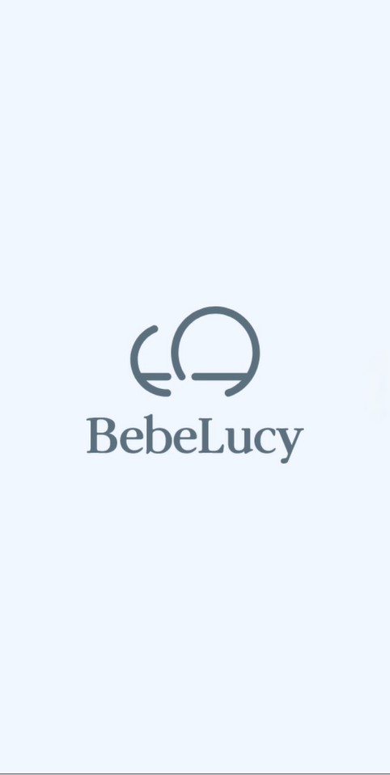
      </td>
      <td>
         <a href="https://drive.google.com/file/d/1LzqKtCCFKvX85juMHstk7__eLRABnv99/view?usp=drive_link">
         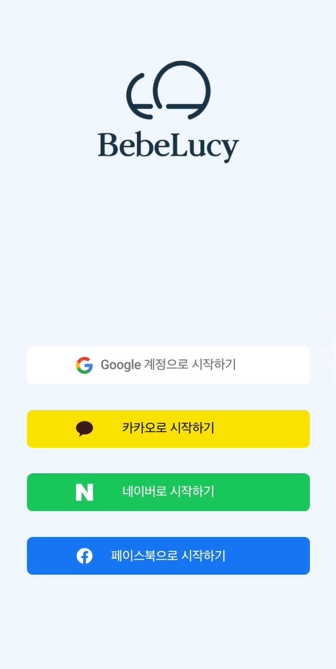
      </td>
      <td>
         <a href="https://drive.google.com/file/d/1LzqKtCCFKvX85juMHstk7__eLRABnv99/view?usp=drive_link">
         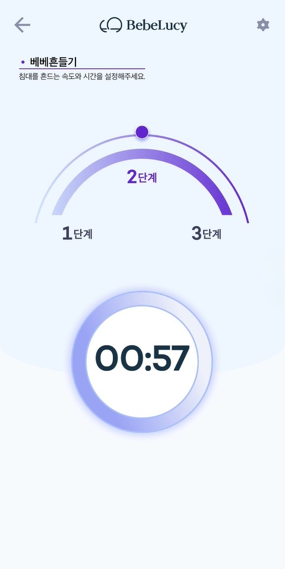
      </td>
      <td>
         <a href="https://drive.google.com/file/d/1LzqKtCCFKvX85juMHstk7__eLRABnv99/view?usp=drive_link">
         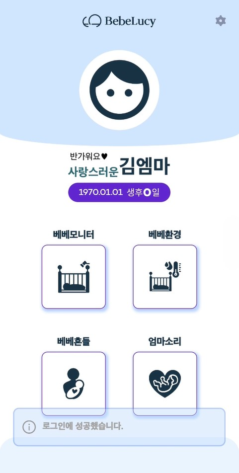
      </td>
      <td>
         <a href="https://drive.google.com/file/d/1LzqKtCCFKvX85juMHstk7__eLRABnv99/view?usp=drive_link">
         
      </td>
   </tr>
   <tr>
      <td>
         <a href="https://drive.google.com/file/d/1LzqKtCCFKvX85juMHstk7__eLRABnv99/view?usp=drive_link">
         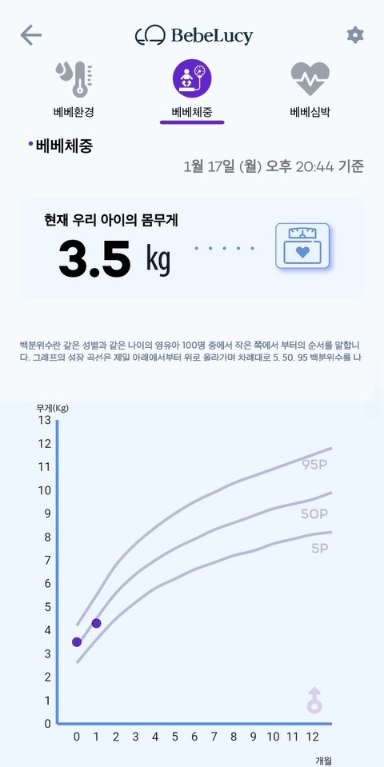
      </td>            
      <td>
         <a href="https://drive.google.com/file/d/1LzqKtCCFKvX85juMHstk7__eLRABnv99/view?usp=drive_link">
         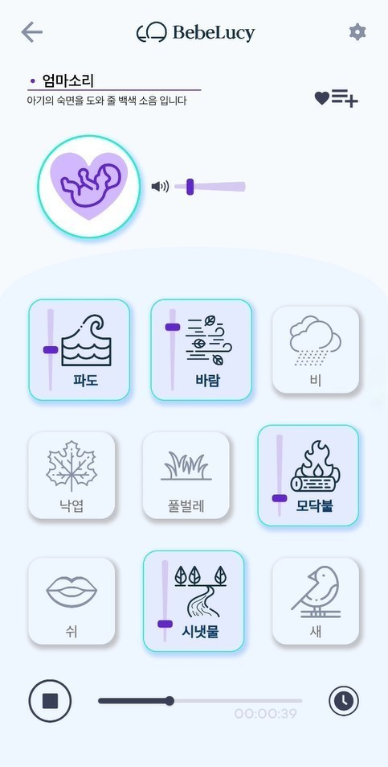
      </td>
      <td>
         <a href="https://drive.google.com/file/d/1LzqKtCCFKvX85juMHstk7__eLRABnv99/view?usp=drive_link">
         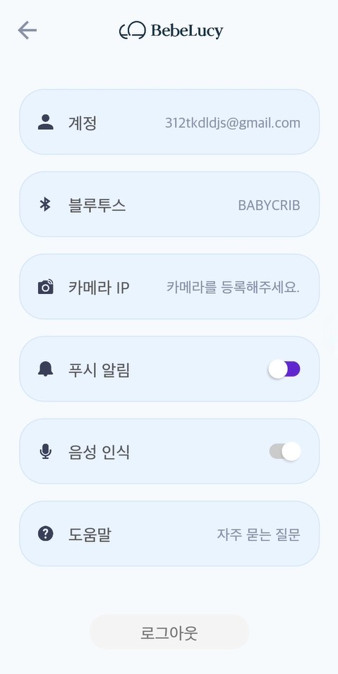
      </td>
      <td>
         <a href="https://drive.google.com/file/d/1LzqKtCCFKvX85juMHstk7__eLRABnv99/view?usp=drive_link">
         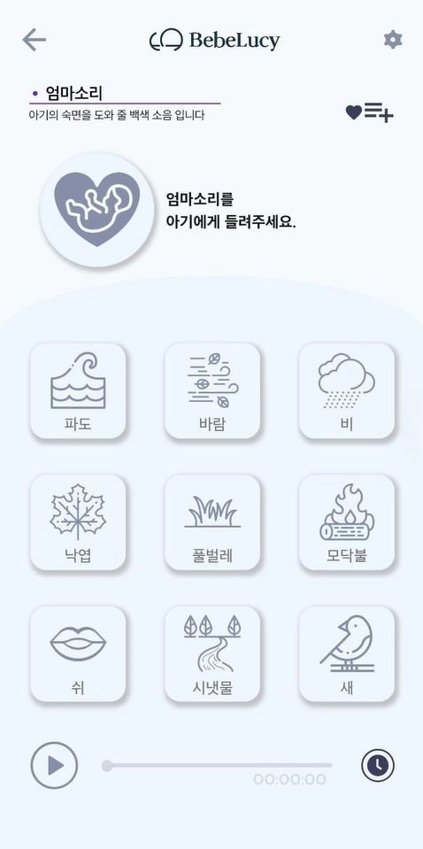
      </td>
      <td>
         <a href="https://drive.google.com/file/d/1LzqKtCCFKvX85juMHstk7__eLRABnv99/view?usp=drive_link">
         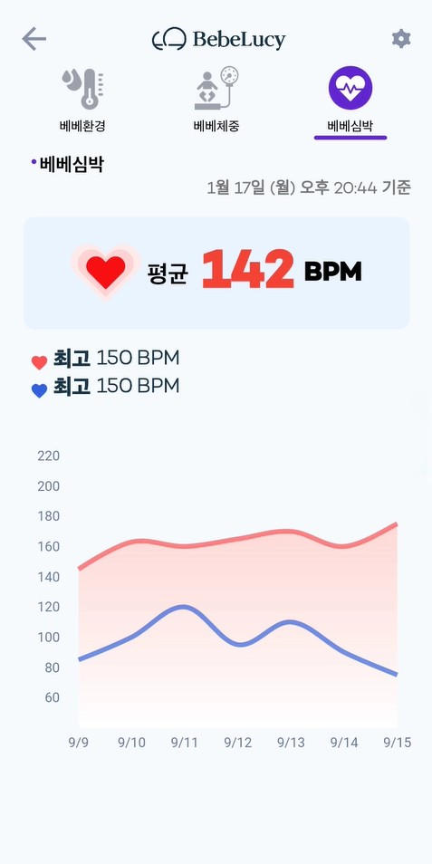
      </td>
      <td>
         <a href="https://drive.google.com/file/d/1LzqKtCCFKvX85juMHstk7__eLRABnv99/view?usp=drive_link">
         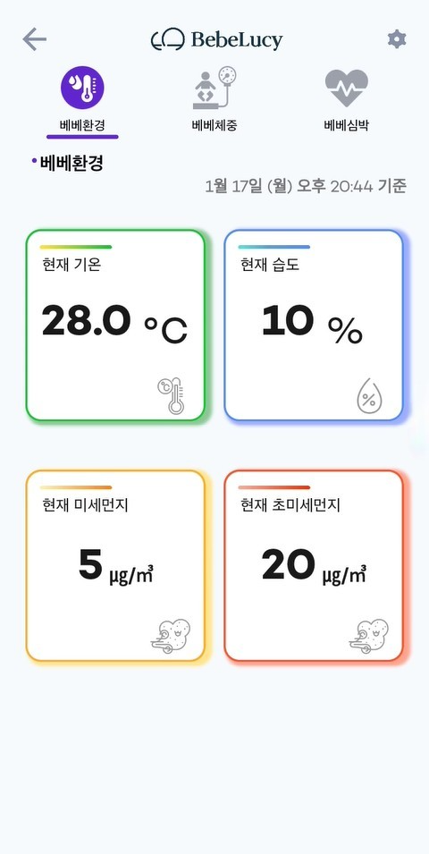
      </td>
    </tr>	
</table>

#### _해당 앱은 각 Store에서 내려가 동영상으로 대체합니다._ 👉🏻[앱 동영상](https://drive.google.com/file/d/1LzqKtCCFKvX85juMHstk7__eLRABnv99/view?usp=drive_link)

<!-- [1.프로젝트 소개](#😀-프로젝트-소개)    
[2.프로젝트내 담당 업무](#🧑‍💻-프로젝트내-담당-업무)  
[3.개발 기간](#⏳️-개발-기간)  
[3.기술 스택](#⚙️-기술-Stack)  
[3.협업 기관](#🙌-Contributing-and-Company)   
[3.주요 기능](#📌-주요-기능)  
[4.개발을 하고 싶어요](#Application-구조) -->


### 🧑‍💻 프로젝트내 담당 업무  
+ 앱 및 기타 개발 -> Flutter를 사용한 앱 개발, Firebase를 사용한 Serverless 구조 개발  
+ 배포 -> PlayStore, AppStore(현재는 Store에서 앱이 내려가 있습니다.)     

### ⏳️ 개발 기간  
2021.03 ~ 2021.10

### ⚙️ 기술 Stack  
* 상태 관리 -> Provider
* Device 통신 -> BLE  
* Serverless -> Firebase

### 📌 주요 기능  
#### MemberShip 기능  
* Firebase를 이용해 로그인, 회원 가입/탈퇴/수정, ID/PWD찾기등을 개발했습니다. 또한, FirebaseFunction을 사용해 소셜 로그인 기능을 개발했습니다.  
 
#### 기기 제어  
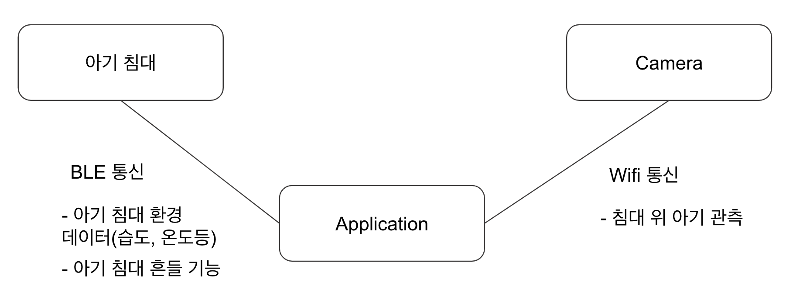 

* BLE를 이용해 기기와 APP을 연동하고, 지정한 프로토콜을 주고 받아 통신합니다. 기기와 연동된 후, APP에서 기기를 제어할 수 있는 프로토콜을 보내 기기 흔들 기능, 기기 환경 데이터를 받을 수 있는 프로토콜을 보내 온도/습도등의 데이터를 받아 APP에 표현해 사용자에게 제공합니다.  
* 또한, 특정 프로토콜을 이용해 침대 위 아기의 몸무게, 심박을 측정해 제공합니다.  
#### 아기 관측
* Wifi를 이용해 Camera와 APP을 연동해 침대 위 아기의 모습을 사용자에게 제공합니다.  
#### 백색 소음  
* 기기에 설치된 블루투스 스피커에 앱에서 실행한 백색소음을 들려줄 수 있습니다. 앱이 포어그라운드, 백그라운드 여부 관계없이 백색소음을 재생할 수 있고, 동시에 10개의 소리까지 실행할 수 있습니다.  

### 🙌 Contributing and Company    
> Emmahc : 앱 개밞 및 배포, Bebelucy Device 설계 및 제작  
> 생산기술연구원 : Bebelucy Device 설계 Support


### Application 구조
<details><summary>ApplicationTree</summary>
   
```bash
├── BLE
│   ├── BLEProvider.dart
│   ├── BabyMonitoringDto.dart
│   ├── BleProtocol.dart
│   └── EnviromentMonitoringDto.dart
├── BLECommunicate
│   ├── BLEProtocol.dart
│   ├── BLEProvider.dart
│   └── BabyEnviromentDto.dart
├── BebeSharedPreference.dart
├── BebelucyColor.dart
├── BebelucyFont.dart
├── CheckCountry
│   └── CheckCountryFactory.dart
├── FCM
│   └── FcmFactory.dart
├── InitSetting.dart
├── LocalDB
│   ├── BabyImageDto.dart
│   ├── DBFactory.dart
│   ├── HeartRateModel.dart
│   ├── LocalDBFactory.dart
│   ├── LocalDBProvider.dart
│   ├── ProfileBirthModel.dart
│   ├── ProfileBloodTypeModel.dart
│   ├── ProfileGenderModel.dart
│   ├── ProfileImageModel.dart
│   ├── ProfileNameModel.dart
│   └── WeightModel.dart
├── Logger
│   └── LoggerFactory.dart
├── MemberShip
│   ├── MemberShipFactory.dart
│   └── MembershipVariables.dart
├── Network
│   └── NetworkObserver.dart
├── Notification
│   └── NotiFactory.dart
├── Page
│   ├── BLEScan
│   │   ├── BLEIconAnimation.dart
│   │   ├── BLEScanDeviceName.dart
│   │   ├── BLEScanPage.dart
│   │   ├── BLEScanPercentAnimation.dart
│   │   ├── BLEScanProvider.dart
│   │   ├── BLEScanSpiralAnimation.dart
│   │   ├── BLESearchText.dart
│   │   └── SpiralPathPainter.dart
│   ├── Camera
│   │   ├── CameraLoadingPage.dart
│   │   └── CameraPage.dart
│   ├── CommonUI
│   │   ├── AutoPositionedList.dart
│   │   ├── BebeToast.dart
│   │   ├── ContextMenu.dart
│   │   ├── LoadingUI.dart
│   │   └── LongList.dart
│   ├── Enviroment
│   │   ├── ActivatedBar.dart
│   │   ├── BabyEnviromentComponent
│   │   │   ├── BabyEnviroment.dart
│   │   │   ├── FineDust.dart
│   │   │   ├── Humidity.dart
│   │   │   ├── Temperature.dart
│   │   │   └── UltraFineDust.dart
│   │   ├── BabyHeartRateComponent
│   │   │   ├── BabyHeartAverage.dart
│   │   │   ├── BabyHeartRate.dart
│   │   │   ├── BabyHeartRateLabel.dart
│   │   │   └── HeartRateGraph.dart
│   │   ├── BabyWeightComponent
│   │   │   ├── BabyNowWeight.dart
│   │   │   ├── BabyWeight.dart
│   │   │   ├── BabyWeightGraph.dart
│   │   │   └── BabyWeightGuideText.dart
│   │   ├── EnviromentCurrentTimeProvider.dart
│   │   ├── EnviromentPage.dart
│   │   ├── EnviromentProvider.dart
│   │   ├── EnviromentTime.dart
│   │   └── EnviromentTopNavigation.dart
│   ├── FAQ
│   │   ├── FAQApplicationLIst.dart
│   │   ├── FAQDrawer.dart
│   │   ├── FAQEtcList.dart
│   │   ├── FAQList.dart
│   │   ├── FAQNavigation.dart
│   │   ├── FAQPage.dart
│   │   ├── FAQProductList.dart
│   │   ├── FAQProvider.dart
│   │   └── FAQTop.dart
│   ├── FetusWhiteNoise
│   │   ├── FetusMomSound.dart
│   │   ├── FetusSlider.dart
│   │   ├── FetusThumb.dart
│   │   ├── FetusWhiteNoiseList.dart
│   │   ├── FetusWhiteNoisePage.dart
│   │   └── FetusWhiteNoiseTitle.dart
│   ├── Home
│   │   ├── HomeBottom.dart
│   │   ├── HomeIcon.dart
│   │   ├── HomePage.dart
│   │   ├── HomeProfile.dart
│   │   ├── HomeTop.dart
│   │   └── TopArc.dart
│   ├── Login
│   │   ├── LoginItem.dart
│   │   ├── LoginPage.dart
│   │   └── LoginUI.dart
│   ├── Profile
│   │   ├── ProfileBirth.dart
│   │   ├── ProfileBloodType.dart
│   │   ├── ProfileGender.dart
│   │   ├── ProfileImage.dart
│   │   ├── ProfileLinear.dart
│   │   ├── ProfileName.dart
│   │   └── ProfilePage.dart
│   ├── Setting
│   │   ├── LogoutButton.dart
│   │   ├── SettingAccountItem.dart
│   │   ├── SettingBLEItem.dart
│   │   ├── SettingCameraItem.dart
│   │   ├── SettingPage.dart
│   │   ├── SettingPushItem.dart
│   │   ├── SettingPushSwitch.dart
│   │   ├── SettingQuestionItem.dart
│   │   ├── SettingVoiceItem.dart
│   │   └── SettingVoiceSwitch.dart
│   ├── Shake
│   │   ├── ShakePage.dart
│   │   ├── ShakeProvider.dart
│   │   ├── ShakeRange.dart
│   │   ├── ShakeRangeAnimation.dart
│   │   ├── ShakeRangeAnimationPath.dart
│   │   ├── ShakeStep.dart
│   │   ├── ShakeTimer.dart
│   │   ├── ShakeTimerEditor.dart
│   │   ├── ShakeTimerIsolate.dart
│   │   └── ShakeTitle.dart
│   ├── Splash
│   │   ├── SplashOpacityAnimation.dart
│   │   ├── SplashPage.dart
│   │   ├── SplashProvider.dart
│   │   └── SplashRotationAnimation.dart
│   └── WhiteNoise
│       ├── MomWhiteNoise.dart
│       ├── PlayerSlider.dart
│       ├── WhiteNoisSliderThumb.dart
│       ├── WhiteNoiseItem.dart
│       ├── WhiteNoiseItemSlider.dart
│       ├── WhiteNoiseMain.dart
│       ├── WhiteNoisePage.dart
│       ├── WhiteNoisePlayer.dart
│       ├── WhiteNoiseProvider.dart
│       ├── WhiteNoiseTimer.dart
│       └── WhiteNoiseTimerSetting.dart
├── Permission
│   └── PermissionFunction.dart
├── RealtimeDB
│   └── RealtimeDBFactory.dart
├── Routes.dart
├── STT
│   └── SttFactory.dart
├── SupportUI.dart
├── TTS
│   └── TtsFactory.dart
├── TestUIPage.dart
├── UpdateApp
│   └── UpdateAlertUI.dart
└── main.dart
``` 
   
</details>
